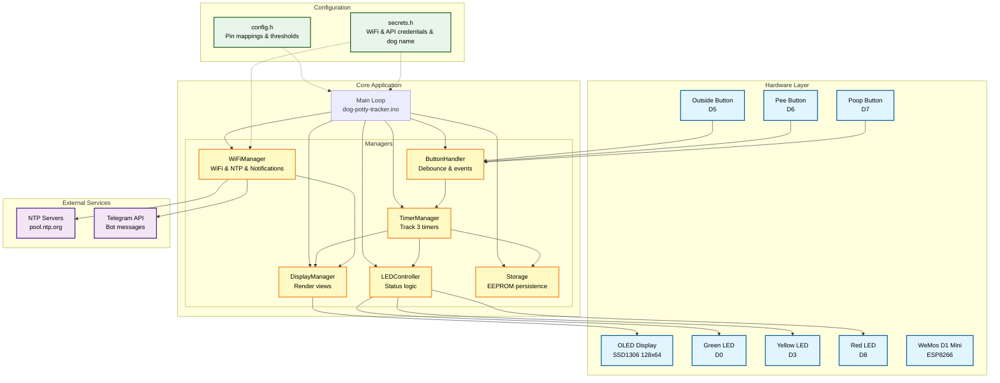

# Dog Potty Tracker

A hardware device to track your dog's potty activities with three independent timers (Outside, Pee, Poop) displayed on an OLED screen with visual LED status indicators.

## Features

- **3 Independent Timers**: Track time since last Outside, Pee, and Poop events
- **OLED Display**: 0.96" display with auto-rotating views (elapsed time and timestamps)
- **LED Status Indicators**: Green (all good), Yellow (warning), Red (urgent)
- **WiFi & NTP Sync**: Automatic time synchronization with automatic DST adjustment
- **Telegram Notifications**: Free push notifications to unlimited users via Telegram bots
- **Remote Commands**: Control timers remotely via Telegram (/pee, /poo, /out, /status)
- **Night Mode**: Configurable quiet hours that turn off display, LEDs, and suppress notifications
- **Data Persistence**: Timers saved to EEPROM, survive power loss
- **Configurable Dog Name**: Personalize notifications with your dog's name

## Architecture



## Hardware Required

### Components

- **WeMos D1 Mini** (ESP8266 ESP-12F) - micro USB, WiFi-enabled
- **UCTRONICS 0.96" OLED** (SSD1306, 128x64, I2C)
- **3x Tactile Push Buttons** (Outside, Pee, Poop)
- **3x LEDs** (Green, Yellow, Red - standard 5mm)
- **3x 10k-ohm Resistors** (button pull-down)
- **3x 220-330 ohm Resistors** (LED current limiting)
- **Breadboard** (optional): 170-point minimum, 400-point recommended
- **Jumper Wires**

### Total Cost
Approximately $10-15 for all components

## Pin Connections

### OLED Display (I2C)
- VCC -> 3V3
- GND -> GND
- SCL -> D1 (GPIO5)
- SDA -> D2 (GPIO4)

### Buttons
- Button 1 (Outside) -> D5 (GPIO14) + 10k-ohm resistor to GND
- Button 2 (Pee) -> D6 (GPIO12) + 10k-ohm resistor to GND
- Button 3 (Poop) -> D7 (GPIO13) + 10k-ohm resistor to GND
- All buttons: One leg to 3V3, other leg to pin

### Status LEDs
- LED Green -> D0 (GPIO16) + 220-330 ohm resistor
- LED Yellow -> D3 (GPIO0) + 220-330 ohm resistor
- LED Red -> D8 (GPIO15) + 220-330 ohm resistor
- All LEDs: Anode (+) to pin through resistor, Cathode (-) to GND

## Software Setup

### 1. Install Arduino IDE

1. Download Arduino IDE 2.x from https://www.arduino.cc/en/software
2. Install and launch Arduino IDE

### 2. Install ESP8266 Board Support

1. Open File -> Preferences
2. Add to "Additional Board Manager URLs":
   ```
   http://arduino.esp8266.com/stable/package_esp8266com_index.json
   ```
3. Go to Tools -> Board -> Boards Manager
4. Search "esp8266" and install "esp8266 by ESP8266 Community"
5. Select board: Tools -> Board -> ESP8266 Boards -> "LOLIN(WEMOS) D1 R2 & mini"

### 3. Install Required Libraries

Open Tools -> Manage Libraries and install:

- **Adafruit SSD1306** (by Adafruit)
- **Adafruit GFX Library** (by Adafruit)
- **ESP8266WiFi** (built-in with ESP8266 board package)
- **Time** (by Michael Margolis)
- **EEPROM** (built-in)

### 4. Configure WiFi Credentials, Dog Name, and Night Mode

1. Copy `dog-potty-tracker/secrets.h.example` to `dog-potty-tracker/secrets.h`
2. Edit `dog-potty-tracker/secrets.h` with your WiFi credentials, dog's name, and night mode hours:
   ```cpp
   const char* WIFI_SSID = "YourNetworkName";
   const char* WIFI_PASSWORD = "YourPassword";
   const char* DOG_NAME = "Fish";  // Your dog's name (used in notifications)

   // Night Mode Configuration (optional - quiet hours)
   const int NIGHT_MODE_START_HOUR = 23;  // 11 PM (24-hour format: 0-23)
   const int NIGHT_MODE_END_HOUR = 5;     // 5 AM (24-hour format: 0-23)
   ```
3. Save the file (this file is ignored by git for security)

**Night Mode Behavior:**
- **Display:** Turns off completely during night mode hours
- **LEDs:** All status LEDs turn off during night mode hours
- **Notifications:** All Telegram and Alexa notifications are suppressed
- **Buttons:** Still work - pressing any button wakes the display for 10 seconds and logs the event
- **Timers:** Continue running in the background
- **Disable:** Set both hours to `-1` to disable night mode entirely

### 5. Configure Display Mode (Optional)

The display can operate in three different modes, configured in `secrets.h`:

1. Edit `dog-potty-tracker/secrets.h` and set the display mode:
   ```cpp
   // Display Mode Configuration
   const int DISPLAY_MODE = 2;  // 0 = elapsed only, 1 = timestamps only, 2 = cycle, 3 = large rotating
   const int DISPLAY_CYCLE_SECONDS = 5;  // Seconds between view changes when in cycle mode
   ```

**Display Modes:**

- **Mode 0 (Elapsed Time Only)**: Display always shows time since last event
  ```
  OUT: 2h 15m ago
  PEE: 0h 45m ago
  POO: 1h 30m ago
  3:45 PM
  ```

- **Mode 1 (Timestamps Only)**: Display always shows actual time of event (requires WiFi/NTP sync)
  ```
  OUT: 1:30 PM
  PEE: 3:00 PM
  POO: 2:15 PM
  3:45 PM
  ```

- **Mode 2 (Cycle - Default)**: Display automatically rotates between elapsed and timestamps every X seconds
  - Best of both worlds - see both elapsed time and actual timestamps
  - Configurable rotation interval via `DISPLAY_CYCLE_SECONDS` (default: 5 seconds)

- **Mode 3 (Large Rotating)**: Display rotates through each timer individually with LARGE text (easier to read from distance)
  - Shows one timer at a time with bigger letters
  - Each timer displays: timer name, elapsed time, and timestamp
  - Example (rotates every X seconds):
  ```
  OUTSIDE          <- Large text (2x size)
  2h 15m ago       <- Large text (2x size)
  At: 1:30 PM      <- Normal text
  ```
  ```
  PEE              <- Large text (2x size)
  0h 45m ago       <- Large text (2x size)
  At: 3:00 PM      <- Normal text
  ```
  ```
  POOP             <- Large text (2x size)
  1h 30m ago       <- Large text (2x size)
  At: 2:15 PM      <- Normal text
  ```

**When to use each mode:**
- **Mode 0**: Prefer seeing "how long ago" (e.g., "2h 15m ago")
- **Mode 1**: Prefer seeing "what time" (e.g., "1:30 PM")
- **Mode 2**: Want to see both - display switches automatically
- **Mode 3**: Need larger text for easier reading from across the room

### 6. Configure Telegram Notifications (Optional - Free!)

Telegram is completely free and provides instant push notifications to your phone.

#### Step 1: Create Your Telegram Bot
1. Open Telegram app on your phone
2. Search for "@BotFather" and start a chat
3. Send `/newbot` command
4. Follow the prompts to name your bot (e.g., "Dog Potty Tracker")
5. BotFather will give you a **Bot Token** - save this! (looks like `123456789:ABCdefGHIjklMNOpqrsTUVwxyz`)

#### Step 2: Get Your Chat ID
1. Start a chat with your new bot (click the link BotFather provides)
2. Send `/start` to your bot
3. Visit this URL in your browser (replace `<YourBotToken>` with your actual token):
   ```
   https://api.telegram.org/bot<YourBotToken>/getUpdates
   ```
4. Look for `"chat":{"id":123456789}` in the response
5. Save your **Chat ID** (the number after `"id":`)

#### Step 3: Add Bot Details to secrets.h
1. Copy `dog-potty-tracker/secrets.h.example` to `dog-potty-tracker/secrets.h` (if not already done)
2. Edit `dog-potty-tracker/secrets.h` and add your bot token and chat ID:
   ```cpp
   // User 1
   const char* TELEGRAM_BOT_TOKEN_1 = "123456789:ABCdefGHIjklMNOpqrsTUVwxyz";
   const char* TELEGRAM_CHAT_ID_1 = "123456789";

   // User 2 (optional)
   const char* TELEGRAM_BOT_TOKEN_2 = "";  // User 2 bot token
   const char* TELEGRAM_CHAT_ID_2 = "";    // User 2 chat ID

   // User 3 (optional)
   const char* TELEGRAM_BOT_TOKEN_3 = "";  // User 3 bot token
   const char* TELEGRAM_CHAT_ID_3 = "";    // User 3 chat ID
   ```
3. Save the file

**Multiple Users Setup:**
- Each person creates their own bot following Steps 1-2
- Each person gets their own bot token and chat ID
- Add each person's credentials to `secrets.h`
- Leave token and chat ID blank (`""`) to disable notifications for that slot
- **All users receive the same notifications** (both yellow warnings and red urgent alerts)

**Example:**
- User 1: Create bot "Dog Tracker 1" → Get token & chat ID → Add as `TELEGRAM_BOT_TOKEN_1` and `TELEGRAM_CHAT_ID_1`
- User 2: Create bot "Dog Tracker 2" → Get token & chat ID → Add as `TELEGRAM_BOT_TOKEN_2` and `TELEGRAM_CHAT_ID_2`
- All users will receive identical notifications!

**Notification Behavior:**

The device sends notifications based on LED status (using your dog's name from DOG_NAME):

1. **Yellow LED turns on (90 minutes)** - All users:
   - Message: "{DOG_NAME} should go out soon (Xh Ym since last pee)"
   - Example: "Fish should go out soon (1h 30m since last pee)"
   - 1-hour cooldown between yellow notifications

2. **Red LED turns on (3 hours)** - All users:
   - Message: "{DOG_NAME} needs to pee NOW! (Xh Ym since last pee)"
   - Example: "Fish needs to pee NOW! (3h 15m since last pee)"
   - 1-hour cooldown between red notifications

3. **Red LED turns off (dog peed)** - All users:
   - Message: "All clear! {DOG_NAME} has peed."
   - Example: "All clear! Fish has peed."
   - Only sent when you press the Pee button while red LED is on

**Quiet Hours:**
- No notifications are sent between 10pm and 7am
- Timers and device continue working normally

**Display Feedback:**
- "Yellow Alert Sent (2)" - Yellow notification sent to 2 users
- "Red Alert Sent (3)" - Red notification sent to 3 users

#### Remote Commands via Telegram

You can remotely control the timers by sending commands to your Telegram bot! This is perfect when someone else takes the dog out, or when you're away from the device.

**Available Commands:**
- `/pee` - Reset the pee timer remotely
- `/poo` or `/poop` - Reset the poop timer remotely
- `/out` or `/outside` - Reset the outside timer remotely
- `/status` - Get current status of all timers

**How It Works:**
1. Open your Telegram chat with your bot
2. Send any command (e.g., `/pee`)
3. The device receives the command within ~1 second
4. Timer is reset and saved to EEPROM
5. Display shows "Pee! (Remote)" for confirmation
6. Bot sends you a confirmation reply: "Pee timer reset!"

**Status Command Example:**

Send `/status` to get:
```
Fish Status:
Outside: 2h 15m ago
Pee: 0h 45m ago
Poop: 1h 30m ago

Last times:
Outside: 1:30 PM
Pee: 4:00 PM
Poop: 3:15 PM
```

**Security:**
- Only messages from authorized Chat IDs (configured in secrets.h) are processed
- Each user can only control the device through their own bot
- Unauthorized messages are automatically ignored

**Use Cases:**
- Someone else takes the dog out and you want to update timers from your phone
- You're at work and want to check if the dog needs to go out
- Quick timer updates without physically pressing buttons

### 7. Install USB Driver (if needed)

If your computer doesn't recognize the WeMos D1 Mini:
- WeMos D1 Mini uses **CH340** USB-to-serial chip
- Download driver from: https://www.wemos.cc/en/latest/ch340_driver.html
- Install and restart Arduino IDE

## Deployment Instructions

### Upload to Device

1. **Connect WeMos D1 Mini** to your computer via micro USB cable

2. **Configure Arduino IDE**:
   - Board: "LOLIN(WEMOS) D1 R2 & mini"
   - Upload Speed: 921600 (or 115200 if upload fails)
   - CPU Frequency: 80 MHz
   - Flash Size: "4MB (FS:2MB OTA:~1019KB)"
   - Port: Select the COM port where D1 Mini is connected

3. **Open the sketch**:
   - File -> Open -> `dog-potty-tracker/dog-potty-tracker.ino`

4. **Verify/Compile**:
   - Click the checkmark icon or Sketch -> Verify/Compile
   - Check for any errors

5. **Upload**:
   - Click the arrow icon or Sketch -> Upload
   - Wait for "Done uploading" message

6. **Monitor Output** (optional):
   - Tools -> Serial Monitor
   - Set baud rate to **115200**
   - You should see WiFi connection status and debug output

### First Boot

1. Device will attempt to connect to WiFi (displays "Connecting WiFi...")
2. Once connected, it will sync time via NTP (displays "Syncing time...")
3. Display will show all three timers counting up from 00h 00m
4. Green LED should turn on (all good status)
5. Display behavior depends on your DISPLAY_MODE setting:
   - **Mode 0**: Shows elapsed time only (e.g., "2h 15m ago")
   - **Mode 1**: Shows timestamps only (e.g., "1:30 PM")
   - **Mode 2** (default): Auto-rotates every 5 seconds (configurable) between elapsed and timestamps

## Usage

### Button Functions

**Outside Button**
- Logs "went outside" event
- Resets Outside timer only

**Pee Button**
- Logs "pee" event
- Resets Pee timer only

**Poop Button**
- Logs "poop" event
- Resets Poop timer only

### LED Status Indicators

LEDs are based on the **Pee timer only**:

- **Green**: Pee timer < 90 minutes (all good)
- **Yellow**: Pee timer > 90 minutes (warning)
- **Red**: Pee timer > 3 hours (urgent)

### Night Mode (Configurable Quiet Hours)

During night mode (default: 11pm - 5am, configurable in secrets.h):

- **Display:** Turns off completely to avoid light disturbance
- **LEDs:** All status LEDs turn off
- **Notifications:** All Telegram and Alexa notifications are suppressed (no alerts during sleep hours)
- **Buttons:** Still functional - pressing any button wakes display for 10 seconds AND logs the event
- **Timers:** Continue running accurately in the background
- **Configuration:** Hours can be customized in secrets.h, or disabled entirely by setting both to -1

### Display Views

The display can show three different modes (configured in `secrets.h`):

**Mode 0 - Elapsed Time Only**
```
OUT: 2h 15m ago
PEE: 0h 45m ago
POO: 1h 30m ago
3:45 PM
```

**Mode 1 - Timestamps Only**
```
OUT: 1:30 PM
PEE: 3:00 PM
POO: 2:15 PM
3:45 PM
```

**Mode 2 - Auto-Rotate (Default)**

Cycles between the two views above at a configurable interval (default: 5 seconds).
This gives you both perspectives - elapsed time and actual timestamps.

## Troubleshooting

### OLED Not Displaying

- Check I2C address (0x3C or 0x3D)
  - Run I2C scanner code from CLAUDE.md to find address
  - Update `OLED_ADDRESS` in `config.h` if needed
- Verify wiring: SDA->D2, SCL->D1
- Ensure VCC connected to 3V3
- Check if Adafruit_SSD1306 library is installed

### Button Not Responding

- Verify pull-down resistor (10k-ohm to GND)
- Check button wiring: one leg to 3V3, other to GPIO
- Test with multimeter: should read 0V when not pressed, 3.3V when pressed
- Try increasing debounce delay in `config.h`

### LEDs Not Lighting

- Check polarity: anode (+) to GPIO through resistor, cathode (-) to GND
- Verify resistor value (220-330 ohm)
- Test LED directly: connect anode to 3V3, cathode to GND
- Check if correct pin defined in `config.h`

### WiFi Not Connecting

- Verify credentials in `secrets.h`
- Check 2.4GHz WiFi (ESP8266 doesn't support 5GHz)
- Monitor Serial output for connection status
- Device still works without WiFi (shows elapsed timers only)

### Time Not Syncing

- Verify WiFi is connected first
- Check NTP server accessibility
- Ensure timezone offset is correct in `config.h`
- May take 1-2 seconds on first sync

### EEPROM Data Corrupted

- Check checksum verification logic
- EEPROM may be blank on first boot (expected)
- Device will initialize to zero and start fresh

## Configuration

**Edit `secrets.h` for personal settings:**
- **Dog Name**: Your dog's name (used in all notifications)
- **Night Mode Hours**: Customize quiet hours or disable (set to -1)
- **Display Mode**: Choose elapsed only (0), timestamps only (1), or cycle (2)
- **Display Cycle Interval**: Seconds between view changes in cycle mode
- **WiFi Credentials**: Network name and password
- **Telegram Bots**: Up to 3 user configurations

**Edit `config.h` for hardware/timing settings:**
- **Timer Thresholds**: Adjust yellow/red LED warning times
- **Timezone**: Adjust NTP timezone offset
- **Debounce Delay**: Adjust button sensitivity
- **Pin Mappings**: Change hardware connections

## Power Requirements

- USB powered via micro USB on WeMos D1 Mini
- Always-on device (~80mA draw)
- No battery operation in current version

## Data Persistence

- Timer data automatically saved to EEPROM:
  - On button press (immediate save)
  - Every 5 minutes (automatic backup)
- Data survives power loss and device restarts
- Timers resume from last saved state on boot

## Future Enhancements

Potential features to add:
- WiFi data logging (ThingSpeak, Google Sheets)
- Web interface for viewing history
- Multiple dog support
- Audio alerts (buzzer)
- Battery operation with deep sleep
- 3D printed enclosure

## License

This project is intended for personal use. Modify and enhance as needed.

## Support

For detailed technical documentation, wiring diagrams, and code architecture, see [CLAUDE.md](CLAUDE.md).

---

**Last Updated**: 2025-10-22
**Platform**: WeMos D1 Mini (ESP8266 ESP-12F)
**Arduino IDE**: 2.x
**ESP8266 Board Package**: 3.x
